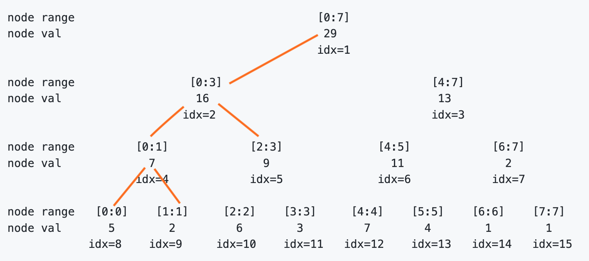

## Segment tree

### What is it
Segment tree is a data structure that stores information about array ranges as a tree.
This allows efficient range queries and updates over an array.

Imagine thousands of people trying to book rooms at Hoshino resort during the holiday season, 
segment tree is able to return the available rooms based on queried dates, and update the 
room availability quickly.

It generally has two operations:
- `query(start, end)`: returns the value of interest from the given range, e.g. range min, max, sum
- `update(start, end, val)`: increase the value of all items in range `[start, end]` in the array by `val`

### Build
Segment trees are usually represented as a list (or dictionary for faster range value retrieval),
and conceptually visualized as a tree.

The following examples are all about `range sum segment tree`, which stores the sums of items in different ranges,
and segment trees below are all represented as dictionaries.

Suppose, the number list is given as: `nums = [5, 2, 6, 3, 7, 4, 1, 1]`, to build the tree, 
1. Create the dictionary `val` that represents the segment tree
2. Copy `nums` to `val` with index key `8, 9, ... 15`. This conceptually fills the bottom level of the tree
    - > val = {**8: 5, 9: 2, 10: 6, 11: 3, 12: 7, 13: 4, 14: 1, 15: 1**} 
3. Start filling the remaining nodes' values by using the fact that `node i is the parent of node 2 * 1 and node 2 * i + 1`. 
    - to be specific, `node 7's value = node 14's value + node 15's value`
    - this continues until the root node is reached 
    - > val = {1: 29, 2: 16, 3: 13, 4: 7, 5: 9, 6: 11, 7: 2, **8: 5, 9: 2, 10: 6, 11: 3, 12: 7, 13: 4, 14: 1, 15: 1**} 

```
node range                                    [0:7]
node val                                       29
                                              idx=1

node range                 [0:3]                               [4:7]
node val                    16                                  13
                          idx=2                                idx=3

node range         [0:1]            [2:3]              [4:5]            [6:7]
node val             7                9                  11               2
                   idx=4            idx=5              idx=6            idx=7

node range   [0:0]    [1:1]     [2:2]    [3:3]     [4:4]    [5:5]    [6:6]    [7:7]      
node val       5        2         6        3         7        4        1        1
            idx=8    idx=9     idx=10    idx=11   idx=12    idx=13   idx=14   idx=15
```

When the build phase is completed, conceptually the tree looks like above, but in code, 
it is represented as a dictionary like below:
> val = {1: 29, 2: 16, 3: 13, 4: 7, 5: 9, 6: 11, 7: 2, **8: 5, 9: 2, 10: 6, 11: 3, 12: 7, 13: 4, 14: 1, 15: 1**} 

### Query and Update 
**Query**

Continue from the range sum segment tree above, querying here means returning the sum of all items in the given range `[start, end]`. 

This can be done recursively from the root node. In each step, check for overlaps between the current node's range and 
the given range to decide how recursion should continue. There are three cases:
1. given range does not overlap with the current node's range, return 0
    - e.g. `given range = [9: 9], current node idx = 1`
2. current node's range is a subset of the given range 
    - e.g. `given range = [2: 4], current node idx = 5`
3. given range is a subset of the current node's range 
    - e.g. `given range = [6: 7], current node idx = 3`

e.g. `query(1, 3)`
<p float="left">
  
  
</p>

**Update**

Update shares the same logic as Query to carry out the traversal from the root node.
The difference here is that each leaf node in the range `[start, end]` has to be updated independently.
This guarantees that each item covered by the range is updated correspondingly.
(Unlike query, queried value is returned once the appropriate node range is found)

e.g. `update(0, 3, delta=1)`


One drawback of the Update method above is that it's quite slow (O(nlogm)) for large ranges, 
since every single leaf node covered by the range has to be reached before an actual update can happen. 

### Lazy propagation
Lazy propagation solves the issue above. 
As the name implies, node updates happen lazily here, which means that update of the descendent nodes are postponed,
until the descendent nodes themselves are accessed (e.g. when they are queried or updated again).

This is done by using another list (dictionary), `lazy`, that saves the value to be applied to the descendent nodes.
`lazy[i]` holds the value by which the node `val[i]` needs to be incremented, when node `i` is finally accessed or queried. 

In this way, during the traversal, once it's found that the current node's range is a subset of the search range,
 only the nodes from the root node to that current node are actually updated. 
This makes sense. 
Imagine a range that is frequently updated, but rarely queried; updating the descendent nodes whenever 
an update happens is unnecessary if the descendent nodes are never queried. 

e.g. `update(0, 3, delta=1)`


e.g. `query(0, 1)`


### More advanced topics 
Higher dimensional segment tree
 